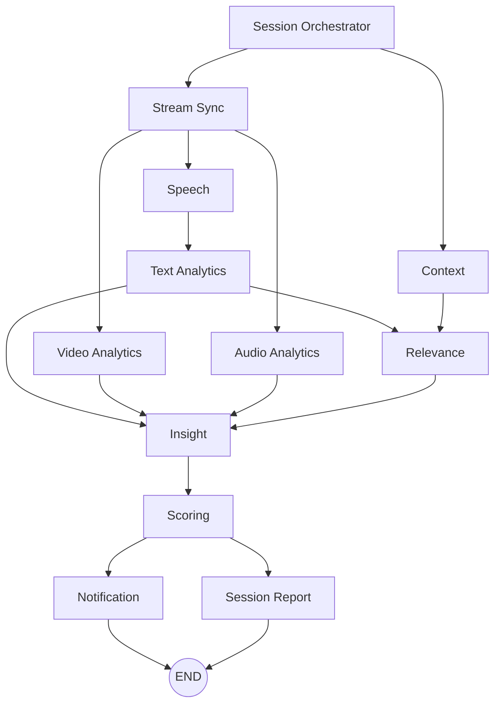

# Persona AI - Multimodal Agentic Workflow V2

A LangGraph-based multimodal interview coaching platform that analyzes video, audio, speech, and text to deliver granular performance scores and post-session feedback. It supports API-based batch analysis and a Streamlit recording UI with a standalone browser recorder.

---

## Key Features

| Capability | Description |
|---|---|
| Visual Analytics | Posture, eye contact, facial expression, and head stability scoring via MediaPipe and OpenCV |
| Audio Analytics | Energy, pitch variation, silence ratio, SNR estimation, and noise detection via librosa |
| Speech-to-Text | Sarvam AI `saaras:v3` with codemix mode for multilingual transcription |
| Language Detection | Sarvam BCP-47 language codes plus Unicode script fallback for Indic languages |
| Regional Language Warning | Shows a warning when more than 2 regional languages are detected in one response |
| Text Evaluation | Grammar, fluency, and professionalism scored by GPT-4.1 with a multilingual-aware rubric |
| Relevance Scoring | Prompt-vs-answer alignment evaluated by GPT-4.1 and normalized to a 0-10 score |
| Recorder UI | Streamlit launcher opens a dedicated webcam recorder tab with upload back to the app |
| Session Summary | Post-session scorecard with visual, audio, text, relevance, language profile, and coaching tips |

---

## Recent UI Changes

- The Streamlit interface uses a light background and an emoji-free UI.
- The `Open Recorder` and `Start Recording` buttons use the app's blue/violet styling instead of red.
- The recorder screen shows a timer in the top-right corner.
- If a recording crosses 5 minutes, the recorder shows a one-time alert asking the user to keep the speech shorter.
- The results dashboard displays detected languages in the Text & Relevance tab.
- If more than 2 regional languages are detected, the dashboard warns that this is not recommended.

---

## Configuration

All model and API settings are managed through `.env` and loaded by `app/core/config.py`.

```python
class Settings(BaseSettings):
    ACTIVE_LLM_PROVIDER: str = "openai"
    DEFAULT_MODEL_NAME: str = "gpt-4.1"
    SPEECH_TO_TEXT_MODEL: str = "saaras:v3"
    SPEECH_LANGUAGE_CODE: str = "unknown"

    OPENAI_API_KEY: str = ""
    SARVAM_API_KEY: str = ""

    CONFIDENCE_THRESHOLD: float = 0.7
    PAUSE_ALERT_SECONDS: float = 3.0
```

Copy `.env.example` to `.env` and fill in your API keys before running.

---

## Repository Structure

```text
persona-ai/
|-- app/
|   |-- main.py                    # FastAPI app: /analyze and /analyze-url
|   |-- api/
|   |   `-- endpoints.py           # Health check and WebSocket session streaming
|   |-- core/
|   |   `-- config.py              # Dynamic settings
|   |-- models/
|   |   `-- state.py               # Global Pydantic models
|   |-- orchestrator/
|   |   |-- state.py               # AgentState TypedDict
|   |   `-- graph.py               # LangGraph compiler
|   `-- agents/
|       |-- stream_sync.py         # Timestamp and buffer management
|       |-- video.py               # Visual analytics
|       |-- audio.py               # Batch audio extraction, transcription, language detection
|       |-- speech.py              # Streaming STT and multilingual language detection
|       |-- text.py                # Grammar, fluency, language-limit handling
|       |-- context.py             # Prompt and scenario context
|       |-- relevance.py           # Answer-vs-prompt alignment
|       |-- insight.py             # Merges module outputs
|       |-- scoring.py             # Weighted scoring helpers
|       |-- notification.py        # Coaching alerts
|       `-- session_report.py      # Timeline summary and recommendations
|-- app/pipeline/batch_analyser.py # Sequential post-session analysis pipeline
|-- streamlit_app.py               # Streamlit UI and standalone recorder server
|-- test_language_detection.py     # Batch language detection harness
|-- requirements.txt
|-- .env.example
`-- LICENSE
```

---

## Workflow Graph

The LangGraph orchestrator wires 11 agent nodes:



To print the graph:

```bash
python print_graph.py
```

---

## Scoring Breakdown

| Dimension | Weight | Scale | Source |
|---|---:|---|---|
| Visual Performance | 20% | 0-10 | `video.py` |
| Audio Performance | 25% | 0-10 | `audio.py` plus LLM speech scoring |
| Text Quality | 20% | 0-10 | `text.py` |
| Relevance | 35% | 0-10 | GPT-4.1 relevance evaluation |
| Overall | 100% | 0-10 | Weighted sum |

---

## Multilingual Language Detection

The batch pipeline detects languages during audio transcription:

1. Sarvam `speech_to_text.transcribe` runs with `language_code="unknown"` and `mode="codemix"`.
2. Each chunk's BCP-47 `language_code` is mapped to a display name such as `Bengali`, `Hindi`, `Telugu`, or `English`.
3. A Unicode script fallback scans transcript text for Indic scripts when API metadata is missing or weak.
4. Detected languages are passed into text scoring and displayed in the Streamlit results dashboard.

Supported display languages include Hindi, Bengali, Tamil, Telugu, Kannada, Malayalam, Gujarati, Odia, Punjabi, Assamese, Urdu, Nepali, Konkani, Kashmiri, Sindhi, Sanskrit, Santali, Manipuri, Bodo, Maithili, Dogri, and English.

### Regional Language Guidance

English plus up to 2 regional languages is treated as the recommended limit. If the app detects more than 2 regional languages, for example:

```text
Languages: Bengali, English, Hindi, Telugu
```

the Streamlit dashboard shows:

```text
You are using more than 2 regional languages (Bengali, Hindi, Telugu), which is not recommended.
```

---

## Recorder Workflow

The Streamlit app runs a small local recorder server on port `8502`.

1. Open the Streamlit app.
2. Choose the performer role, target audience, and prompt.
3. Click `Open Recorder`.
4. In the recorder tab, click `Start Recording`.
5. The recorder shows a timer in the top-right corner.
6. If recording crosses 5 minutes, a popup asks the user to keep the speech shorter.
7. Click `Stop`; the WebM/MP4 blob uploads automatically to the app.
8. Return to Streamlit, click `Recording Ready`, then `Analyse Session`.

The recorder saves uploads under `uploads/`, and batch analysis extracts audio with FFmpeg before transcription.

---

## Getting Started

### Prerequisites

- Python 3.10+
- FFmpeg and FFprobe available on `PATH`
- An OpenAI API key
- A Sarvam AI API key

### Installation

```bash
git clone https://github.com/Uponika/persona-ai.git
cd persona-ai

python -m venv venv
source venv/bin/activate      # Linux/Mac
venv\Scripts\activate         # Windows

pip install -r requirements.txt

cp .env.example .env
```

Edit `.env` and add `OPENAI_API_KEY` and `SARVAM_API_KEY`.

---

## Run the Batch API Server

```bash
uvicorn app.main:app --reload
```

| Method | Path | Description |
|---|---|---|
| `GET` | `/` | API welcome message |
| `POST` | `/analyze` | Upload a video file for full analysis |
| `POST` | `/analyze-url` | Analyze a video URL from JSON |
| `GET` | `/api/v1/health` | Health check |

Quick test:

```bash
curl -X GET "http://localhost:8000/api/v1/health"
```

---

## Run the Streamlit UI

```bash
streamlit run streamlit_app.py
```

The Streamlit UI provides:

- Role and prompt setup
- Dedicated recorder tab with camera and microphone permissions
- Automatic upload when recording stops
- Post-session scorecard
- Detected language display and regional-language warning
- Video, audio, text, and relevance feedback

---

## Run Smoke Tests

```bash
python test_workflow.py
python test_language_detection.py
```

---

## Tech Stack

| Layer | Technology |
|---|---|
| Orchestration | LangGraph `StateGraph` |
| API Server | FastAPI + Uvicorn |
| UI | Streamlit |
| Recorder | Browser MediaRecorder API plus local Python HTTP server |
| Vision | MediaPipe Holistic, OpenCV |
| Audio | librosa, pydub, FFmpeg |
| STT | Sarvam AI `saaras:v3` codemix |
| LLM Scoring | OpenAI GPT-4.1 |
| State Management | Pydantic + TypedDict |

---

## License

MIT - see [LICENSE](LICENSE).
