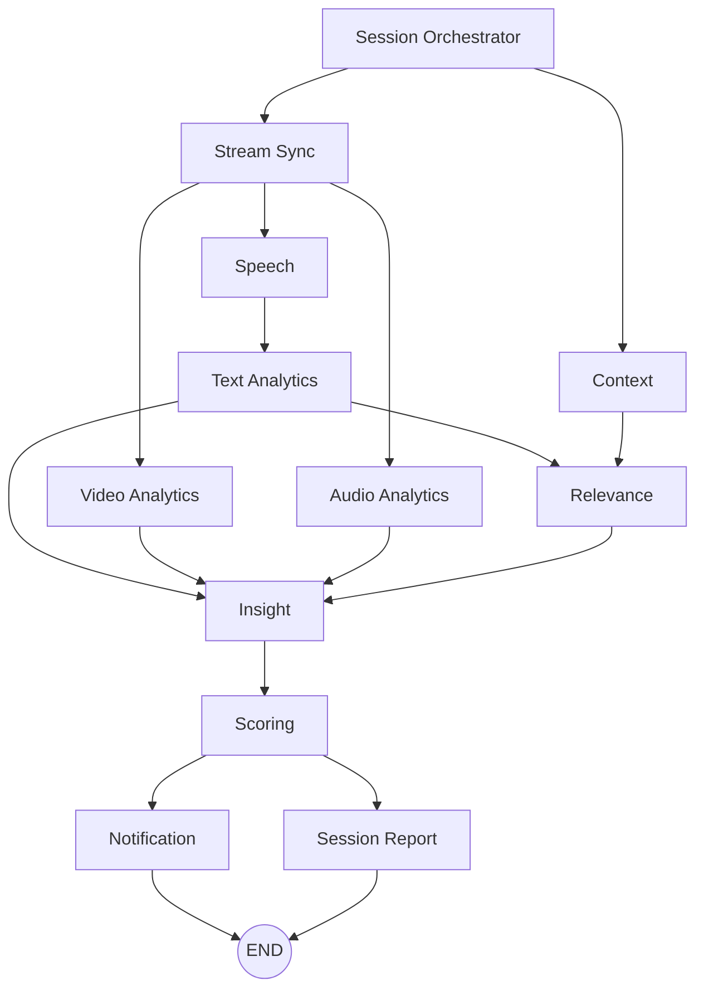

# Persona AI — Multimodal Agentic Workflow V2

A **LangGraph-based multimodal interview coaching platform** that analyzes video, audio, speech, and text in real time to deliver granular performance scores and live coaching feedback. Supports both **batch video analysis** (file upload / URL) and **live webcam streaming** via a Streamlit UI.

---

## Key Features

| Capability | Description |
|---|---|
| **Visual Analytics** | Posture, eye contact, facial expression scoring via MediaPipe Holistic |
| **Audio Analytics** | Energy, pitch variation, SNR estimation, and noise detection via librosa |
| **Speech-to-Text** | Sarvam AI (`saaras:v3`) with codemix mode for multilingual transcription |
| **Language Detection** | API-level BCP-47 language codes with percentage + confidence filtering; Unicode script fallback for 9+ Indic languages |
| **Text Evaluation** | Grammar, fluency, and professionalism scored by GPT-4.1 with multilingual-aware rubric |
| **Relevance Scoring** | Prompt-vs-answer alignment evaluated by GPT-4.1 (0–50 scale → normalized to 0–10) |
| **Live Coaching Alerts** | Real-time positive reinforcement and corrective warnings for posture, eye contact, audio, grammar, and relevance |
| **Session Summary** | Post-session scorecard with granular visual sub-scores, language profile, and actionable takeaways |

---

## Configuration

All model and API settings are managed through the `.env` file (see `.env.example`). The settings are loaded dynamically via `app/core/config.py`:

```python
class Settings(BaseSettings):
    ACTIVE_LLM_PROVIDER: str = "openai"
    DEFAULT_MODEL_NAME: str = "gpt-4.1"
    SPEECH_TO_TEXT_MODEL: str = "saaras:v3"
    SPEECH_LANGUAGE_CODE: str = "unknown"

    OPENAI_API_KEY: str = ""
    SARVAM_API_KEY: str = ""

    CONFIDENCE_THRESHOLD: float = 0.7
    PAUSE_ALERT_SECONDS: float = 3.0
```

Copy `.env.example` to `.env` and fill in your API keys before running.

---

## Repository Structure

```
persona-ai/
├── app/
│   ├── main.py                    # FastAPI app — batch /analyze & /analyze-url endpoints
│   ├── api/
│   │   └── endpoints.py           # Health check & WebSocket session streaming
│   ├── core/
│   │   └── config.py              # Dynamic settings (LLM, STT, thresholds)
│   ├── models/
│   │   └── state.py               # Global Pydantic models
│   ├── orchestrator/
│   │   ├── state.py               # AgentState TypedDict for the StateGraph
│   │   └── graph.py               # LangGraph compiler — wires all 11 agents
│   └── agents/
│       ├── stream_sync.py         # Timestamp & buffer management
│       ├── video.py               # Visual analytics (posture, eye contact, expression)
│       ├── audio.py               # Vocal analytics (energy, pitch, SNR, noise)
│       ├── speech.py              # STT & multilingual language detection (Sarvam)
│       ├── text.py                # Grammar, fluency, language-limit enforcement
│       ├── context.py             # Prompt, topic, rubric, interview question
│       ├── relevance.py           # Answer-vs-prompt alignment tracking
│       ├── insight.py             # Merges module outputs for scoring
│       ├── scoring.py             # Weighted overall score + batch scoring helpers
│       ├── notification.py        # Real-time coaching alerts (warnings + praise)
│       └── session_report.py      # Timeline summary & recommendations
├── streamlit_app.py               # Live webcam + mic streaming UI
├── test_workflow.py               # Quick graph invocation smoke test
├── test_language_detection.py     # Batch language-detection test harness
├── print_graph.py                 # Prints the compiled LangGraph to terminal
├── tests/
│   └── mixed_beng+eng_bad.mp4    # Sample multilingual test video
├── requirements.txt
├── .env.example
└── LICENSE                        # MIT
```

---

## Workflow Graph

The LangGraph orchestrator wires **11 agent nodes** with the following execution flow:



To print the graph in your terminal:
```bash
python print_graph.py
```

---

## Scoring Breakdown

| Dimension | Weight | Scale | Source Agent |
|---|---|---|---|
| Visual Performance | 20% | 0–10 | `video.py` (posture 40%, eye contact 30%, expression 30%) |
| Audio Performance | 30% | 0–10 | `audio.py` (energy + pitch + SNR) |
| Text Quality | 20% | 0–10 | `text.py` (GPT-4.1 grammar rubric) |
| Relevance | 30% | 0–10 | `relevance.py` (GPT-4.1, raw 0–50 ÷ 5) |
| **Overall** | — | 0–10 | `scoring.py` (weighted sum of above) |

---

## Live Coaching Alerts

The **notification agent** emits real-time coaching alerts during a live session:

- ⚠️ **Warnings** — triggered when a sub-score drops below **5.0** (posture, eye contact, audio, text < 4, relevance < 4)
- ✅ **Praise** — triggered when a sub-score exceeds **7.0**
- 🔇 **Noise detection** — SNR-based alert when background noise is high
- 🗣️ **Language limit** — alert if more than 3 languages detected (English + 2 regional)

---

## Multilingual Language Detection

The speech agent uses a **two-tier detection strategy**:

1. **Primary — Sarvam API `language_code`**: Each STT chunk returns a BCP-47 code and confidence. Codes are accumulated across the session and filtered by percentage (≥ 5%) and confidence (≥ 0.3).
2. **Fallback — Unicode script analysis**: If the API returns no language codes, the transcript text is scanned for Indic script characters (Devanagari, Bengali, Tamil, Telugu, Kannada, Malayalam, Gujarati, Odia, Gurmukhi).

Supported languages include Hindi, Bengali, Tamil, Telugu, Kannada, Malayalam, Gujarati, Odia, Punjabi, Assamese, Urdu, Nepali, Konkani, Kashmiri, Sindhi, Sanskrit, Santali, Manipuri, Bodo, Maithili, Dogri, and English.

---

## Getting Started

### Prerequisites
- Python 3.10+
- An [OpenAI API key](https://platform.openai.com/) (GPT-4.1)
- A [Sarvam AI API key](https://www.sarvam.ai/) (Saaras V3 STT)

### Installation

```bash
# 1. Clone and enter the project
git clone https://github.com/Uponika/persona-ai.git
cd persona-ai

# 2. Create a virtual environment
python -m venv venv
source venv/bin/activate    # Linux/Mac
venv\Scripts\activate       # Windows

# 3. Install dependencies
pip install -r requirements.txt

# 4. Configure environment
cp .env.example .env
# Edit .env and add your OPENAI_API_KEY and SARVAM_API_KEY
```

### Run — Batch API Server

```bash
uvicorn app.main:app --reload
```

**Endpoints:**

| Method | Path | Description |
|---|---|---|
| `GET` | `/` | API welcome message |
| `POST` | `/analyze` | Upload a video file for full analysis |
| `POST` | `/analyze-url` | Pass a `{"video_url": "..."}` JSON body |
| `GET` | `/api/v1/health` | Health check |

**Quick test:**
```bash
curl -X GET "http://localhost:8000/api/v1/health"
```

### Run — Live Streamlit UI

```bash
streamlit run streamlit_app.py
```

This opens a browser page with:
- Live webcam + microphone capture (WebRTC)
- Real-time score tracking and coaching alerts
- Post-session summary with granular feedback

### Run — Graph Smoke Test

```bash
python test_workflow.py
```

---

## Tech Stack

| Layer | Technology |
|---|---|
| Orchestration | LangGraph `StateGraph` |
| API Server | FastAPI + Uvicorn |
| Live UI | Streamlit + streamlit-webrtc |
| Vision | MediaPipe Holistic, OpenCV |
| Audio | librosa, pydub, moviepy |
| STT | Sarvam AI (saaras:v3, codemix mode) |
| LLM Scoring | OpenAI GPT-4.1 (text, relevance, body language interpretation) |
| State Management | Pydantic + TypedDict with annotated reducers |

---

## Quick Start — Live Demo

```bash
streamlit run streamlit_app.py
```

---

## License

MIT — see [LICENSE](LICENSE).
